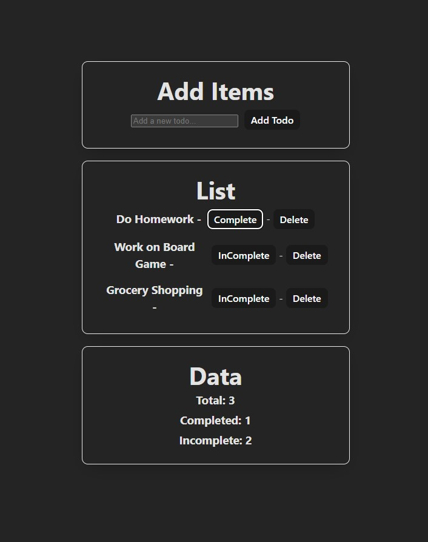

# hw27-react-todo-list
Build a simple React todo list application that demonstrates your understanding of useState and event handling. This project focuses on the core concepts with a practical, real-world example.



## Learning Objectives:

-   Practice useState hook with arrays and objects
-   Handle click and form events
-   Build controlled components
-   Apply basic state management patterns
-   Work with lists and keys in React

## Requirements

### Functional Requirements

#### Core Features

1.  Display Todos
    -   Show a list of todos
    -   Each todo should have text and completion status
    -   Display count of remaining todos

2.  Add Todos
    -   Input field for new todo text
    -   Submit button to add todo
    -   Clear input after adding
    -   Prevent adding empty todos

3.  Toggle Completion
    -   Click on todo text to mark complete/incomplete
    -   Visual feedback for completed todos
    -   Update remaining count

4.  Delete Todos
    -   Delete button for each todo
    -   Remove todo from list
    -   Update count after deletion

### Technical Requirements

#### State Management

-   Use useState for todos array
-   Use useState for input field
-   Handle array state updates properly
-   Use proper state update patterns

#### Component Structure

-   Create 1 main component: **App.jsx**
-   Use proper JSX structure
-   Include comments explaining your code

#### Code Quality

-   Follow React naming conventions
-   Include comments for each state variable
-   Use proper event handling
-   Ensure the app works without errors

## Getting Started

### Setup Instructions

1.  Create a new Vite React project: **npm create vite@latest my-todo-app -- --template react**
2.  Navigate to the project: **cd my-todo-app**
3.  Install dependencies: **npm install**
4.  Start the development server: **npm run dev**
5.  Replace the default **App.jsx** with your code

### Project Structure
```text
src/
├──  App.jsx
└──  main.jsx
```
Implementation Guide
--------------------

### Step 1: Set Up Your Component

1.  Create a new Vite React project
2.  Open **src/App.jsx** and clear the default content
3.  Import React and useState
4.  Create a functional component called **App**
5.  Add a basic return statement with a heading

**Prompt:** What two pieces of state will you need for a todo list? Think about what data changes as users interact with your app.

### Step 2: Plan Your State Structure

You'll need to track:
-   A list of todos (what data type should this be?)
-   The current input value (what data type should this be?)

**Prompt:** Each todo should be an object. What properties should each todo have? Think about what information you need to display and manage each todo item.

### Step 3: Create the Form Section

Build a form that includes:
-   An input field for new todo text
-   A submit button
-   Proper event handling

**Prompts:**

-   How will you make the input controlled? (Hint: you need both value and onChange)
-   What event should you listen for on the form? (Hint: onSubmit)
-   How will you prevent the page from refreshing when the form is submitted?
-   How will you clear the input after adding a todo?

### Step 4: Create Event Handler Functions

You'll need to create several functions:

**handleInputChange:**

-   What parameter should this function accept?
-   How will you update the input state?

**handleSubmit:**

-   What should happen when the form is submitted?
-   How will you create a new todo object?
-   How will you add it to the todos array?
-   How will you clear the input?

**CHOOSE ONE OF THE FOLLOWING**

**toggleTodo:**

-   What parameter should this function accept?
-   How will you find the specific todo to update hint: map?
-   How will you toggle the completed status?

**deleteTodo:**

-   What parameter should this function accept?
-   How will you remove a specific todo from the array hint: filter?

### Step 5: Display the Todo List

Create the display section that includes:
-   A count of remaining todos (OPTIONAL)
-   A list of all todos
-   Each todo should show its text and have click handlers

**Prompts:**

-   How will you count the remaining (incomplete) todos?
-   How will you map over the todos array to display each one?
-   What should happen when someone clicks on a todo?
-   How will you show visual feedback for completed todos?
-   What should happen when someone clicks the delete button?

### Step 6: Add Styling and Polish

-   Add basic styling to make it look good
-   Add a message when there are no todos
-   Test all functionality

**Prompts:**

-   How will you style completed todos differently?
-   What should you display when the todos array is empty?
-   How will you make buttons and inputs look clickable?

## Code Structure Hints

### State Setup

```jsx
// You'll need two useState hooks
const  [todos,  setTodos]  =  useState(/* what should the initial value be? */);
const  [newTodo,  setNewTodo]  =  useState(/* what should the initial value be? */);
```
### Event Handlers

```jsx
// Think about what each function needs to do
const  handleInputChange  =  (event)  =>  {
  // How do you get the value from the event?
  // How do you update the state?
};

const  handleSubmit  =  (event)  =>  {
  // How do you prevent the default form behavior?
  // How do you check if the input is not empty?
  // How do you create a new todo object?
  // How do you add it to the todos array?
  // How do you clear the input?
};
```
### JSX Structure

```jsx
return  (
  <div>
    <h1>My  Todo  List</h1>

    {/* Form section */}
    <form  onSubmit={/* what function? */}>
      <input
        type="text"
        value={/* what state variable? */}
        onChange={/* what function? */}
        placeholder="Add a new todo..."
      />
      <button  type="submit">Add  Todo</button>
    </form>

    {/* Count and list section */}
    {/* How will you count remaining todos? */}
    {/* How will you map over the todos array? */}
  </div>
);
```